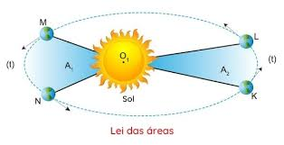

# 🌐 Breve História da Astronomia Ocidental

No dia 12/06, nós continuamos o assunto do encontro do dia 29/05

# 🚩 A Revolução Copernica

A Revolução Copernica marcou uma mudança radical na forma como entendemos o universo. Nicolau Copérnico propôs um modelo heliocêntrico, com o Sol no centro, 
desafiando a visão do geocêntrismo. Foi uma transformação fundamental na compreensão do universo, que ocorreu no início da Idade Moderna. Essa nova perspectiva transformou a Astronomia e a nossa compreensão do nosso lugar no cosmos. **Foi o principal marcador da saída do Geocentrismo para o Héliocentrismo.**

## 🌌 Nicolau Copérnico(1473 d.C. a 1543 d.C.)
Astrônomo, matemático e médico polonês que revolucionou a astronomia com a sua teoria heliocêntrica, que afirmava que o Sol, e não a Terra, era o centro do universo.
A sua principal obra, "Sobre as Revoluções dos Corpos Celestes", foi publicada em 1543, no ano em que ele morreu. Esta obra, que detalha a teoria heliocêntrica, foi um marco na história da astronomia, dando início à astronomia moderna e influenciando outros campos da ciência e do desenvolvimento humano. 

## ☄️ Tycho Brahe (1546 d.C. a 1601 d.C.)
Astrônomo dinamarquês conhecido por suas observações astronômicas incrivelmente precisas das posições dos planetas e estrelas(antes dos telescópios). Seus dados foram essenciais para Johannes Kepler formular as leis do movimento planetário. Teve a teoria geo-heliocêntrica, que também é conhecida como sistema tychônico(é um modelo do sistema solar proposto por Tycho Brahe no século XVI).

## Johannes Kepler (1571 d.C. a 1630 d.C.)
Formulou as três leis que descrevem o movimento planetário:

- "Os plenetas se movem em órbitas elípticas ao redor do Sol, que ocupa um dos focos da elipse."

- "O raio que liga o planeta ao Sol varre áreas iguais em tempos iguais.
- T² proporcional a R³ ()
